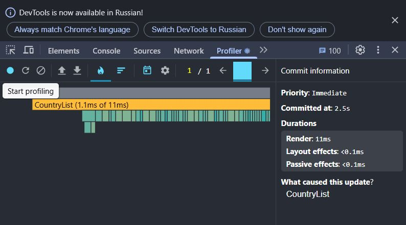
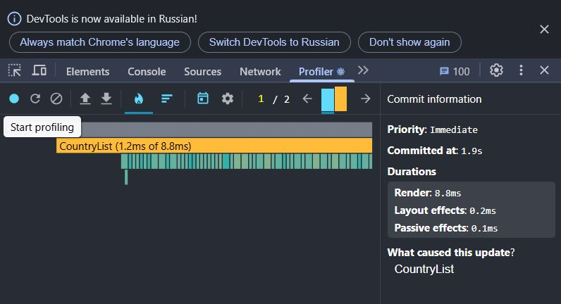
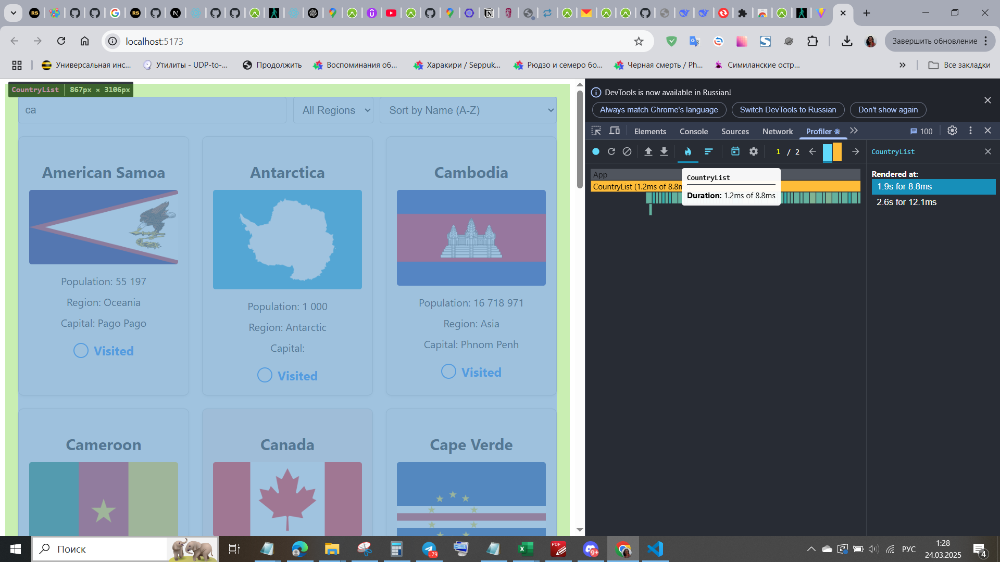
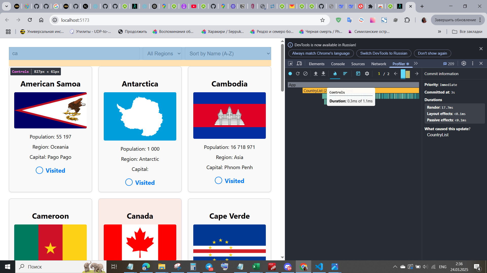
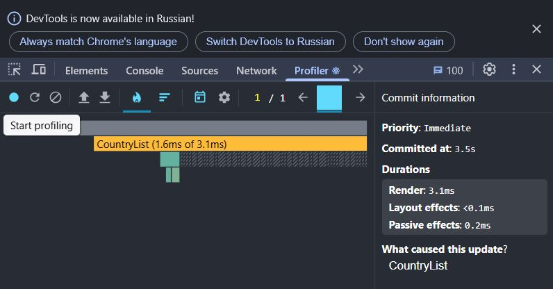
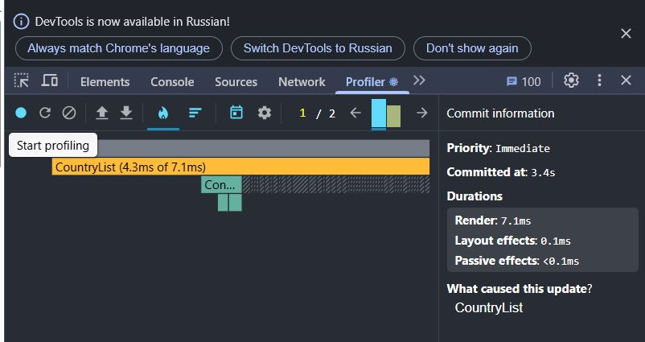
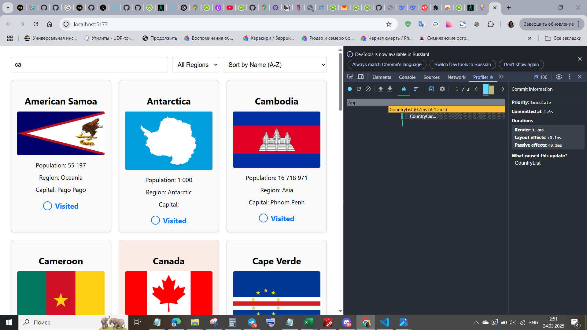
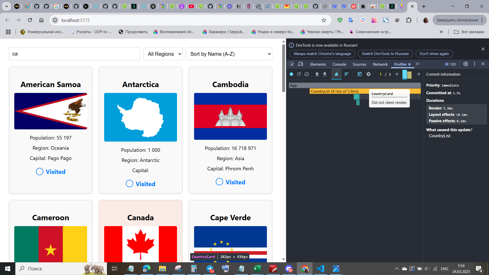
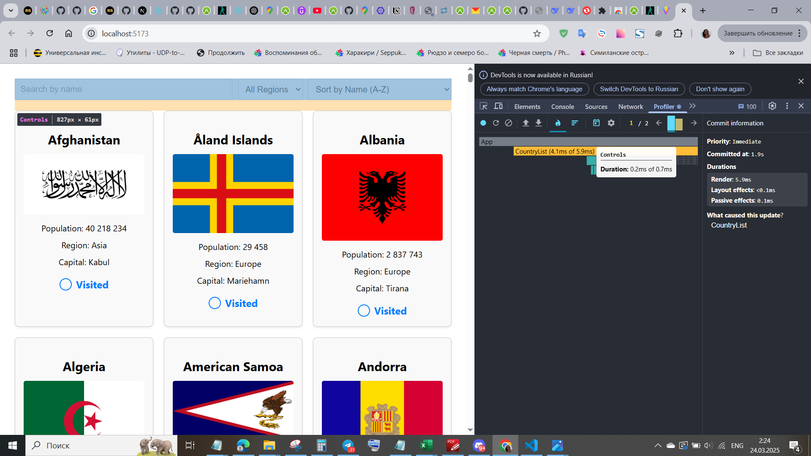

### Country Explorer

### Overview

Country Explorer is a React application that allows users to browse countries, filter them by region, search by name, and sort by name or population. Users can also mark countries as visited, with this data being persisted in local storage.

### Features

- Fetch and display country data from an API
- Search for countries by name
- Filter countries by region
- Sort countries alphabetically or by population
- Mark countries as visited
- Persist visited countries using local storage

### Initial Profiling with React Dev Tools Profiler

#### Profiling Parameters

Before optimization, we used the React Dev Tools Profiler to analyze the application's performance. We focused on the following key metrics:

- **Commit Duration**: Time taken for React to render committed updates
- **Render Duration**: Time taken for individual components to render
- **Interactions**: User interactions that triggered renders
- **Flame Graph**: Visual representation of component render times
- **Ranked Chart**: Sorted list of components by render duration

#### Performance Analysis Before and After Optimization

| Metric                            | Before Optimization | After Optimization | Improvement |
| --------------------------------- | ------------------- | ------------------ | ----------- |
| **Commit Duration (Sorting)**     | ~11ms               | ~3.1ms             | 71.8%       |
| **Commit Duration (Searching)**   | ~8.8ms              | ~7.1ms             | 19.3%       |
| **Render Duration (CountryList)** | ~1.2ms              | ~0.7ms             | 41.7%       |
| **Render Duration (CountryCard)** | ~0.2ms              | ~0ms               | 100%        |
| **Render Duration (Controls)**    | ~0.3ms              | ~0.2ms             | 33.3%       |
| **Unnecessary Re-renders**        | High                | Low                | Significant |

#### Visual Representation:

- **Flame Graph Before Optimization**: Showed unnecessary renders of `CountryCard` components when updating search or sorting.
- **Flame Graph After Optimization**: Showed fewer unnecessary re-renders.
- **Ranked Chart Before Optimization**: `CountryCard` had the longest render duration due to repeated renders of all items.
- **Ranked Chart After Optimization**: `CountryCard` render duration significantly reduced.

**Screenshots of the Profiler:**

**Before Optimization:**

  

**After Optimization:**

### Optimization with React.memo and useMemo

#### Applied Optimizations

- Wrapped `CountryCard` with `React.memo` to prevent re-renders unless the props change.
- Used `useMemo` for filtered and sorted country lists in `useProcessedCountries` to avoid unnecessary calculations.
- Memoized `toggleVisited` with `useCallback` to avoid passing a new reference on each render.

### Conclusion

Through the use of `React.memo` and `useMemo`, we significantly reduced unnecessary renders, improving performance across the application. Searching and sorting operations now execute faster, and UI interactions are smoother. The React Dev Tools Profiler confirmed these improvements through reduced commit and render durations.
